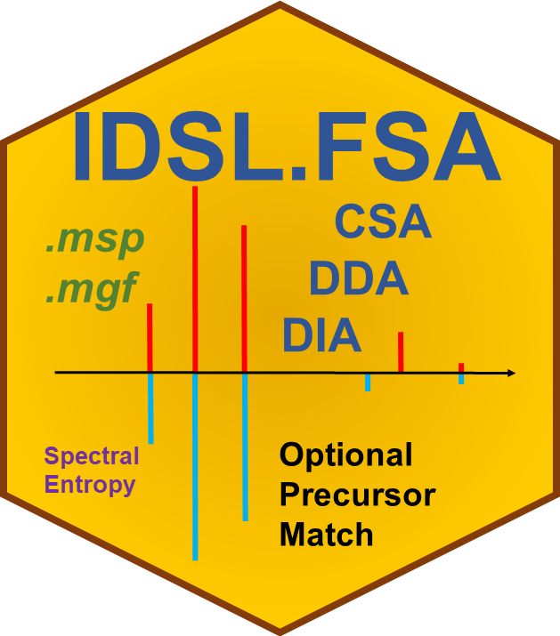

# IDSL.FSA 

<!-- badges: start -->

<!-- badges: end -->

The Fragmentation Spectra Analysis (IDSL.FSA) package was designed to annotate standard .msp (mass spectra format) and .mgf (Mascot generic format) files using mass spectral entropy similarity, dot product (cosine) similarity, and normalized Euclidean mass error (NEME). IDSL.FSA also provides a number of modules to convert and manipulate MSP and MGF files.

IDSL.FSA is consistent with various msp and mgf structures particularly from NIST, GNPS, MoNA, IDSL.CSA libraries.

Visit https://fsa.idsl.me/ for the detailed documentation and tutorial.
