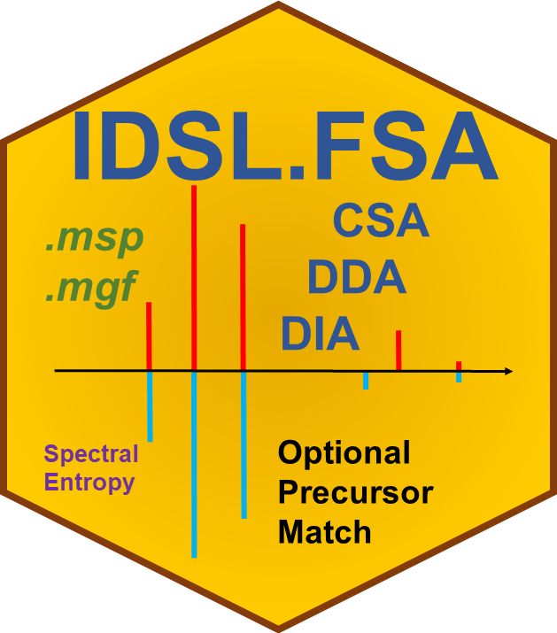

# IDSL.FSA 

<!-- badges: start -->

<!-- badges: end -->

The Fragmentation Spectra Analysis (IDSL.FSA) package was designed to annotate standard .msp (mass spectra format) and .mgf (Mascot generic format) files using mass spectral entropy similarity, dot product (cosine) similarity, and normalized Euclidean mass error (NEME). IDSL.FSA also provides a number of modules to convert and manipulate MSP and MGF files.

## FSDB (Fragmentation Spectra DataBase)
FSDB objects are R readable objects from one or several msp files. FSDB objects facilitate msp annotation and msp data parsing in the R environment. In the *FSDB (Fragmentation Spectra DataBase)* folder, we uploaded FSDB files for GNPS and MoNA public libraries.

### `msp2FSdb`
The `msp2FSdb` module of the IDSL.FSA is used to generate FSDB objects. This module was designed to be consistent with various msp structures particularly from NIST, GNPS, MoNA, IDSL.CSA libraries. The `msp2FSdb` module generally can work for any msp file as long as *Num Peaks* lines are available in the msp file.

### FSDB objects:
FSDB objects are R lists consisting of seven primary objects including:

**logFSdb**: parameters used to create the FSDB object

**PrecursorMZ**: A vector of precursor m/z values

**Retention Time**: A vector of retention time values

**Num Peaks**: A vector of num peaks values indicating number of ions for each fragment spectra

**Spectral Entropy**: A vector of spectral entropy values

**FragmentList**: A list of fragment ions

**MSPLibraryParameters**: A dataframe of tabulated headers and their values for each msp block

## MSP files management
IDSL.FSA was designed to manage MSP format mass spectrometry files with different structures. IDSL.FSA provide various tools to manage *msp* files which a number of them are summarized below:

### `mgf2msp`
The `mgf2msp` convert Mascot generic format files (*.mgf*) into NIST mass spectra format (*.msp*). The `mgf2msp` module is fast which requires <2 sec for mgf files with ~5,000 fragmentation blocks on a single thread.

	mgf2msp(path = getwd(), MGFfileName = "")

***path:*** Location of the original msp file

*MGFfileName:* Name of the mgf file with its extension

The converted files are stored in the same directory with an *.msp* extension.

### `mspSpiltterPosNeg`
In many instances, msp public libraries include both positive and negative fragmentation data in one msp file. Therefore, IDSL.FSA utilized a module, `mspSpiltterPosNeg`, to separate positive and negative msp blocks for a rapid and efficient annotation. This module is so easy to use:

	mspSpiltterPosNeg(path = getwd(), mspFileName = "", number_processing_threads = 1)

***path:*** Location of the original msp file

*mspFileName:* Name of the msp file with its extension

*number_processing_threads:* number of parallel processing threads compatible with the Windows and Linux environments

The isolated MSP blocks are stored in the same directory with "POS_" and "NEG_" prefixes.

### `FSdb2precursorType`
The `FSdb2precursorType` can detect potential ionization pathways for molecular formulas using a vector of InChIKey values from an FSDB. This function only searches for the first 14 InChIKey letters; and therefore, may result with multiple potential precursor types.

	FSdb2precursorType(InChIKeyVector, libFSdb, tableIndicator = "Frequency", number_processing_threads = 1)

*InChIKeyVector:* A vector of InChIKey values. This value may contain whole InChIKey strings or first 14 InChIKey letters.

*libFSdb:* A converted MSP library reference file using the `msp2FSdb` module which is an FSDB produced by the IDSL.FSA package.

*tableIndicator:* c("Frequency", "PrecursorMZ"). To show frequency or a median of *PrecursorMZ* values in the output dataframe for each precursor type.

*number_processing_threads:* number of parallel processing threads compatible with the Windows and Linux environments

A matrix of frequency for each InChIKey in the FSDB. The matrix column headers represent precursor types.

### `FSA_Cytoscape_files_genenerator`
This `FSA_Cytoscape_files_genenerator` module performs pairwise MSP blocks analysis to create Cytoscape networks files. This function is especially beneficial to find related peaks in an analysis.

	FSA_Cytoscape_files_genenerator(path, MSPfile, mspVariableVector = NULL,
	mspNodeID = NULL, massError = 0.01, RTtolerance = NA, minEntropySimilarity = 0.75,
	noiseRemovalRatio = 0.01, allowedNominalMass = FALSE, 
	allowedWeightedSpectralEntropy = TRUE, number_processing_threads = 1)

***path:*** address of msp file

*MSPfile:* name of msp file

*mspVariableVector:* a vector of msp variables

*mspNodeID:* msp Node ID which is the ID that is required for the `specsim' ID generation

*massError:* Mass accuracy in Da

*RTtolerance:* Retention time tolerance (min) to match msp blocks. Select *NA* to ignore retention time match. This option is so helpful to find co-occurring compounds.

*minEntropySimilarity:* Minimum entropy similarity score

*noiseRemovalRatio:* Noise level removal relative to the basepeak to measure entropy similarity score (in percent)

*allowedNominalMass:* c(TRUE, FALSE). Select `TRUE` only for nominal mass analysis.

*allowedWeightedSpectralEntropy:* c(TRUE, FALSE). Weighted entropy to measure entropy similarity score.

*number_processing_threads:* number of parallel processing threads compatible with the Windows and Linux environments

### `FSA_uniqueMSPblockTagger`
This `FSA_uniqueMSPblockTagger` module performs pairwise MSP blocks analysis to create Cytoscape networks files. This function is especially beneficial to find related peaks in an analysis.

	FSA_uniqueMSPblockTagger(path, MSPfile, aggregateBy = "Name", massError = 0.01,
	RTtolerance = NA, minEntropySimilarity = 0.75, noiseRemovalRatio = 0.01,
	allowedNominalMass = FALSE, allowedWeightedSpectralEntropy = TRUE, 
	number_processing_threads = 1)

***path:*** address of msp file

*MSPfile:* name of msp file

*aggregateBy:* a variable to aggregate the MSP blocks based on

*massError:* Mass accuracy in Da

*RTtolerance:* Retention time tolerance (min) to match msp blocks. Select *NA* to ignore retention time match. This option is so helpful to find co-occurring compounds.

*minEntropySimilarity:* Minimum entropy similarity score

*noiseRemovalRatio:* Noise level removal relative to the basepeak to measure entropy similarity score (in percent)

*allowedNominalMass:* c(TRUE, FALSE). Select `TRUE` only for nominal mass analysis.

*allowedWeightedSpectralEntropy:* c(TRUE, FALSE). Weighted entropy to measure entropy similarity score.

*number_processing_threads:* number of parallel processing threads compatible with the Windows and Linux environments

##
Visit https://fsa.idsl.me/ for the detailed documentation and tutorial.
